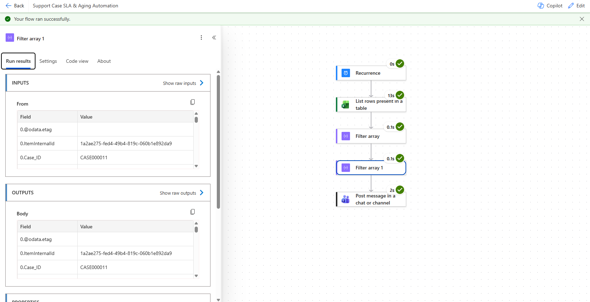

# Support Case SLA & Aging Automation

## Project Overview

This project demonstrates an automated support-case SLA monitoring solution built using Microsoft Power Automate, Excel, OneDrive for Business, and Microsoft Teams.

The workflow processes a synthetic dataset containing 2,000 support cases, identifies open cases, evaluates case aging against priority-based SLA targets, identifies SLA breaches, and automatically sends a summary notification through Microsoft Teams.

All data used in this project is fictional and was created specifically for portfolio and learning purposes.

---

## Business Problem

Support teams may manage hundreds or thousands of active cases across different priorities.

Manually reviewing each case to determine its age and SLA status can be time-consuming and may result in delayed identification of SLA breaches.

The objective of this project was to automate:

- Identification of open support cases
- Case-aging calculation
- Priority-based SLA validation
- SLA breach identification
- SLA breach reporting
- Teams notifications

---

## Dataset

The project uses a synthetic dataset containing **2,000 support cases**.

Example fields include:

- Case ID
- Created Date
- Status
- Priority
- Agent
- Country
- Product
- Support Level
- SLA Hours
- Customer Response Status
- Resolution Date
- Escalation Status

No real customer, employee, or proprietary company data is included.

---

## SLA Rules

| Priority | SLA Target |
|---|---:|
| Critical | 8 Hours |
| High | 24 Hours |
| Medium | 48 Hours |
| Low | 72 Hours |

A case is considered breached when:

`Case Age in Hours > SLA Hours`

---

## Automation Workflow

The optimized workflow follows this process:

`Recurrence → Read Excel Data → Filter Open Cases → Filter SLA Breaches → Send Teams Summary`

### 1. Recurrence

The workflow is designed to run automatically on a scheduled basis.

### 2. Read Support Cases

Power Automate retrieves the support-case dataset from an Excel table stored in OneDrive for Business.

Pagination is enabled to support the complete 2,000-row dataset.

### 3. Filter Open Cases

The first Filter Array keeps only cases where the status is Open.

### 4. Identify SLA Breaches

The second Filter Array dynamically calculates case age using the current date/time and compares it with the SLA target assigned to the case.

This allows the SLA status to change automatically as cases continue aging.

### 5. Teams Notification

Power Automate counts the resulting arrays and sends an SLA summary through Microsoft Teams.

Example successful run:

- **Total Open Cases: 946**
- **SLA Breached Cases: 751**

The number of breached cases is dynamic and can increase as open cases continue to age.

---

## Performance Optimization

The initial workflow used an `Apply to each` loop to evaluate open cases individually.

With hundreds of open cases, sequential processing significantly increased execution time.

The workflow was redesigned using array-based filtering.

### Initial Design

`Open Cases → Apply to each → Calculate Age → Condition → Increment Counter`

### Optimized Design

`Open Cases → Filter SLA Breaches → Count Filtered Array`

This removed unnecessary case-by-case variable updates and produced a simpler and more scalable workflow.

---

## Challenges Solved

During development, several practical automation challenges were addressed:

- Converting Excel serial date/time values for SLA calculations
- Handling numeric vs string data-type mismatches
- Processing large Excel datasets using pagination
- Reducing sequential loop processing
- Preventing oversized Teams messages
- Replacing variable-based counting with array-based counting
- Dynamically calculating SLA status using the current date/time

---

## Technologies Used

- Microsoft Power Automate
- Microsoft Excel
- OneDrive for Business
- Microsoft Teams
- Power Automate Expressions
- Array Filtering
- Workflow Automation
- SLA & Case Aging Logic

---

## Project Screenshots

### Optimized Power Automate Workflow

### Microsoft Teams SLA Summary

## Key Learning

This project demonstrates how business rules can be translated into an automated operational workflow.

It also demonstrates workflow optimization: the original case-by-case processing approach was redesigned into an array-based solution to improve performance when working with a larger dataset.

---

## Data Privacy

The dataset used in this repository is entirely synthetic.

No HP customer data, employee data, internal case information, or confidential company information is included.
